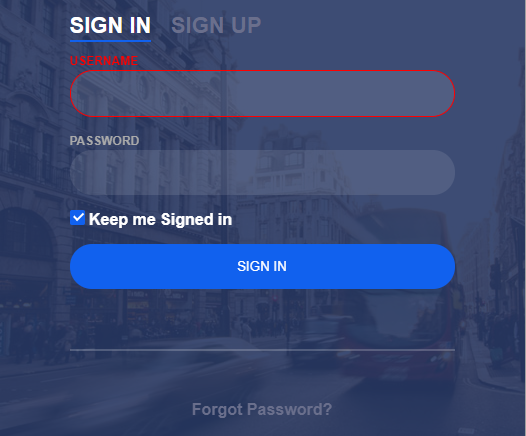

# Vue.js Login

> Formulário de Login implementado em Vue.js com validação de dados.



## Demonstração
Uma demostração funcional pode ser vista aqui: [Demostração](https://github.com/lucianobragaweb/vue-login)

## Build Setup

``` bash
# instala dependências
npm install

# roda servidor com hot reload em localhost:8080
npm run dev

# Compila para produção com minificação
npm run build
```

Para uma explicação mais detalhada sobre como as coisas funcionam, consulte o [docs for vue-loader](http://vuejs.github.io/vue-loader).

## Creditos

> Implementei seguindo um tutorial do Fábio Vedovelli, desponível em: https://www.youtube.com/watch?v=n8eW8D04tNc (Acesso em: 12/02/2018)
